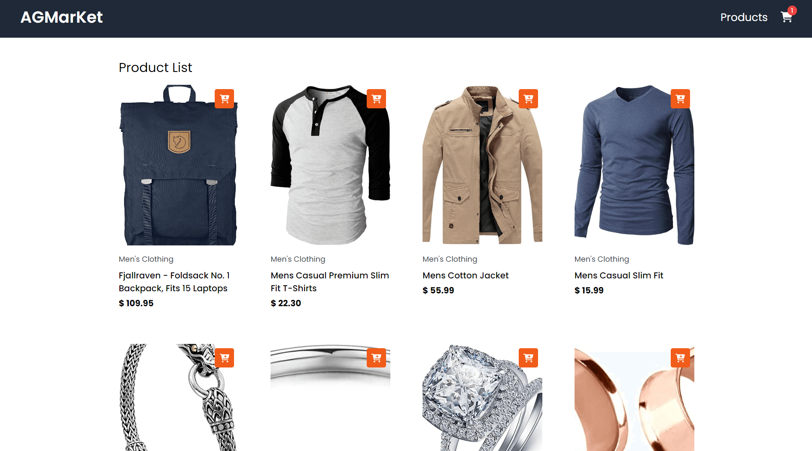
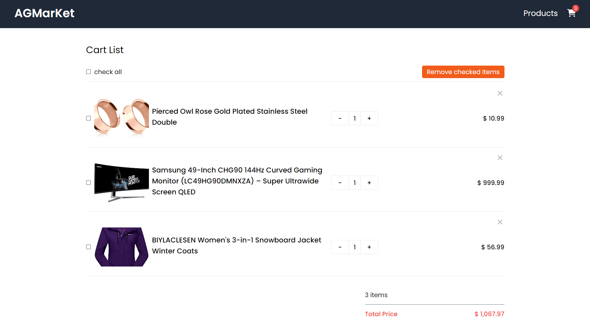

# vite-vue-tailwind-cart

## About This Project

This is an example shopping cart application built using Vue 3 and a range of modern web technologies.

## Technologies Used

- Vue3
- Vue-router
- Vuex
- Vite
- axios
- Tailwind CSS
- fontawesome
- sweetalert2
- ESLint
- Prettier

## Getting Started

1. Clone the repository.
2. Install dependencies using npm install or yarn install.
3. Run the development server using npm run dev or yarn dev.
4. Open your browser and navigate to the development URL.

## Resources

### API

[Fake Store API](https://fakestoreapi.com/)
